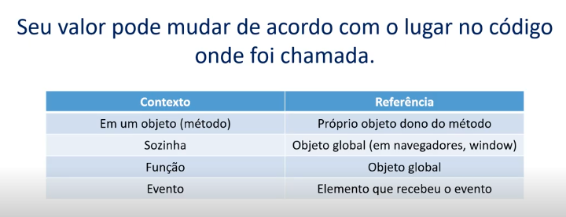

<div align="center">
   
</div>

# Funções

## Tipos de Função

### Estrutura

```javascript
function functionName(params) {
  // code
  return; // return value
}
```

### Função Anônima

```javascript
const sum = function(a, b) {
  return a + b;
}
// also can be written as
const sum = (a, b) => a + b;
```

### Função autoinvocável (IIFE)

IIFE (Immediately Invoked Function Expression) é uma função que é executada imediatamente após sua declaração.

```javascript
(function() {
  // code
})();

// with params
(function(a, b) {
  // code
})(1, 2);
```

### Callback

Callback é uma função que é passada como argumento para outra função.
```javascript
const calc = function(a, b, callback) {
  return callback(a, b);
}

const sum = (a, b) => a + b;
cons sub = (a, b) => a - b;

const resultSub = calc(10, 5, sub); // resultSub = 5
const resultSum = calc(10, 5, sum); // resultSum = 15
```

## Parâmetros

### Valores padrão

Após o ES6, os parâmetros podem ter valores padrão:
```javascript
function exponential(base, exp = 2) {
  return Math.pow(base, exp);
}

exponential(2); // 4
exponential(2, 3); // 8
exponential(3); // 9
```

### Objeto "arguments"

"Arguments" é um objeto que representa todos os parâmetros passados para uma função.
```javascript
function findMax() {
  let max = -Infinity;
  for (let i = 0; i < arguments.length; i++) {
    if (arguments[i] > max) {
      max = arguments[i];
    }
  }
  return max;
}
```
Outro exemplo
```javascript
function showArgs() {
  return arguments;
}

showArgs(1, 2, 3); // [1, 2, 3]
showArgs('a', 'b', 1, 3, 5); // ['a', 'b', 1, 3, 5]
```

### Arrays

`Spread (...)` é uma forma de passar um array para uma função como parâmetros separados. O que era parte de um array se torna um elemento independente.

```javascript
function sum(a, b, c) {
  return a + b + c;
}

const number = [1, 2, 3];

sum(...number)); // 6
```

`Rest`: combina os elementos em um array. O que era um elemento independente se torna parte de um array.

```javascript
function size(...args) {
  return args.length;
}

size(1, 2, 3); // 3
size(1, 2, 3, 4, 5); // 5
```

### Objetos

`Destructuring` é uma forma de extrair valores de um objeto. Entre chaves `{}` podem ser colocados nomes de variáveis que serão criadas com os valores extraídos.

```javascript
const person = {
  name: 'John',
  age: 30
};

const { name, age } = person;
console.log(name); // John
console.log(age); // 30
```

## Loops

### If/Else

```javascript
if (condition) {
  // code
} else {
  // code
}
```

Javascript não tem `elseif`, as palavras sempre estão separadas.

### Switch

 - Equivale a uma comparação de tipo e valor (`===`);
 - Sempre precisa de um valor default;
 - Ideal para quando se precisa compara muitos valores.

```javascript
switch (value) {
  case value1:
    // code
    break;
  case value2:
    // code
    break;
  default:
    // code
}
```

### For

```javascript
const numbers = [1, 2, 3, 4, 5];

function double(numbers) {
  const result = [];
  for (let i = 0; i < numbers.length; i++) {
    result.push(numbers[i] * 2);
  }
  return result;
}

console.log(double(numbers)); // [2, 4, 6, 8, 10]
```

### For In

Percorre todos os elementos de um objeto;

```javascript
const person = {
  name: 'John',
  age: 30,
  email: 'john@doe.com'
};

for (let key in person) {
  console.log(key, person[key]); // name John, age 30, email john@doe.com
}
```

### For Of

```javascript
function logLetters(word) {
  for (let letter of word) {
    console.log(letter);
  }
}
logLetters('Hello'); // H e l l o
```

### While

Executa instruções enquanto a condição for verdadeira.

```javascript
let i = 0;
while (i < 10) {
  console.log(i);
  i++;
} // 0, 1, 2, 3, 4, 5, 6, 7, 8, 9
```

### Do While

- Executa instruções enquanto a condição for verdadeira.
- Executa ao menos uma vez antes de verificar a condição;

```javascript
let i = 0;
do {
  console.log(i);
  i++;
} while (i < 10); // 0, 1, 2, 3, 4, 5, 6, 7, 8, 9
```

## This

O que é `this`?

A palavra chave `this` é usada para referenciar o objeto que está sendo executado, é uma referência de contexto.

```javascript
const person = {
  firstName: 'John',
  lastName: 'Doe',
  fullName: function() {
    return `${this.firstName} ${this.lastName}`;
  },
  age: 30
};

console.log(person.fullName()); // John Doe
```

<div align="center">
  
</div>

### Call e Apply

É possível utilizar `call` ou `apply` para manipular o this;

```javascript
const person = {
  name: 'John',
};

const cat = {
  name: 'Fluffy',
};

function getName() {
  return this.name;
}

getName.call(person); // John
getName.call(cat); // Fluffy
```

A diferença é entre `call` e `apply` é que o segundo permite passar um array como parâmetro;

### Bind

Clona a estrutura da função onde é chamada e aplica o valor do objeto passado como parâmetro;

```javascript
const returnNames = function() {
  return this.name;
};

let bruno = returnNames.bind({ name: 'Bruno' });

console.log(bruno()); // Shhhhh! We don't talk about Bruno!
```

## Arrow Functions

Presentes desde o ES6 (ECMAScript 2015), são funções anônimas, mas com uma sintaxe mais reduzida.

 - Caso exista apenas uma linha de código, pode-se omitir a chave e o return;
 - Caso exista apenas um parâmetro, pode-se omitir os parênteses;

```javascript
const name = 'John';

const sayHi = () => {
  return `Hi ${name}`;
};

sayHi(); // Hi John
```
One line Arrow Functions
```javascript
const sum = (num1, num2) => num1 + num2;

sum(32, 44); // 76
```

Single parameter Arrow Functions
```javascript
const square = num => num * num;

square(5); // 25
```


### Restrições

 - Arrow Functions não fazem hoisting, ou seja, não é possível utilizar variáveis antes de serem declaradas.
 - `this` sempre será o objeto global. Métodos para modificar o this não funcionam;
 - Não existe o objeto `arguments`;
 - O construtor não pode ser usado;

## Atividade 1

```javascript
const students = [
  { name: 'John', grade: 7.5 },
  { name: 'Dave', grade: 9.5 },
  { name: 'Sarah', grade: 5.5 },
  { name: 'Jane', grade: 8.5 }
];

function getPassingStudents(students, minGrade) {
  const passingStudents = [];
  for (let student of students) {
    const { name, grade } = student;

    if (grade >= minGrade) {
      passingStudents.push(student);
    }
  }
  return passingStudents;
}

getPassingStudents(students, 9); // [{ name: 'Dave', grade: 9.5 }]
```
Version 2
```javascript
const students = [
  { name: 'John', grade: 7.5 },
  { name: 'Dave', grade: 9.5 },
  { name: 'Sarah', grade: 5.5 },
  { name: 'Jane', grade: 8.5 }
];

function getPassingStudents(students, minGrade) {
  const passingStudents = students.filter(student => student.grade >= minGrade);
  return passingStudents;
}

getPassingStudents(students, 7); 
// [{ name: 'John', grade: 7.5 }, { name: 'Dave', grade: 9.5 }, { name: 'Jane', grade: 8.5 }]
```

## Atividade 2
```javascript
function sumAge(years) {
  return `In ${years} years, ${this.name} will be ${this.age + years} years old.`;
}

const dog = {
  name: 'Bob',
  age: 3
}

const human = {
  name: 'John',
  age: 30
}

console.log(sumAge.call(dog, (5))) // In 5 years, Bob will be 8 years old.
console.log(sumAge.apply(human, [15])) //In 15 years, John will be 45 years old.
```