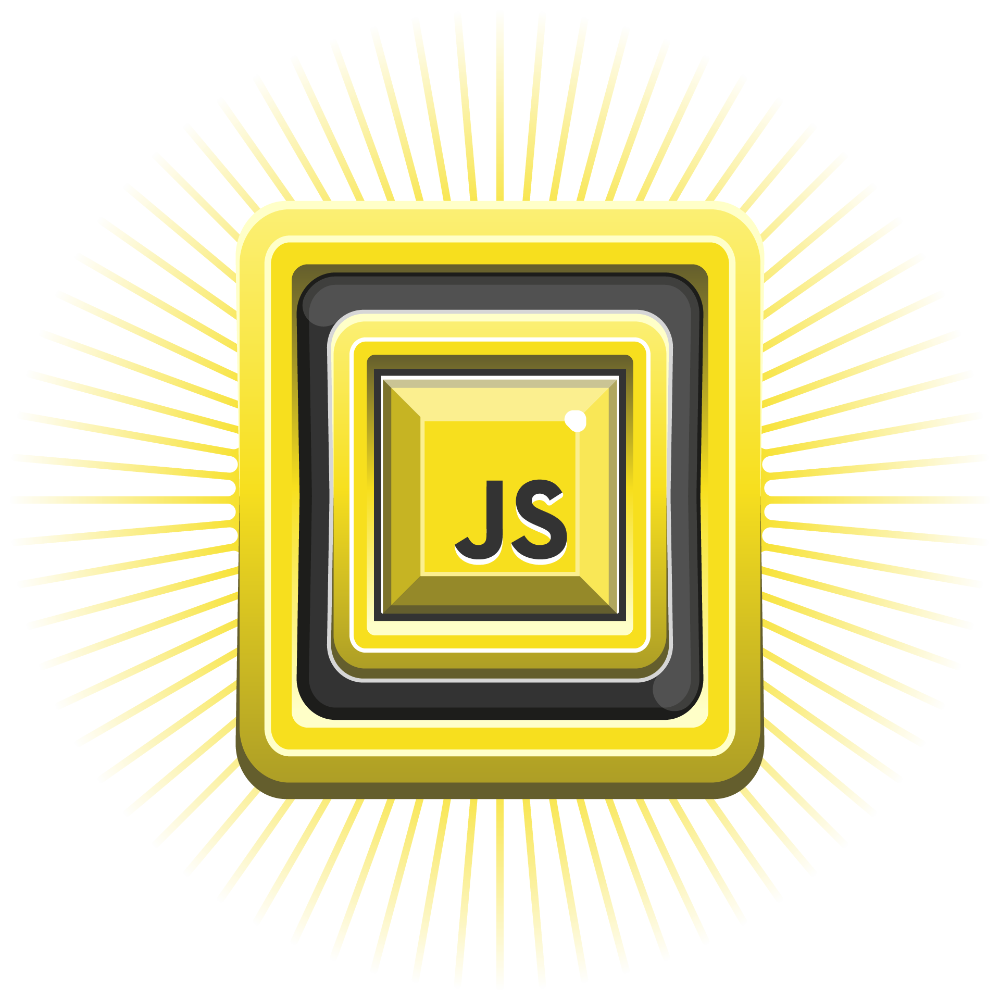
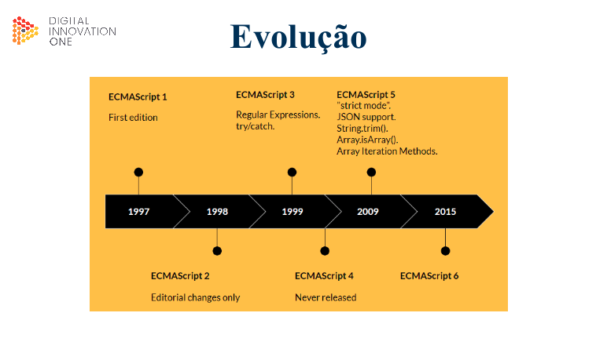
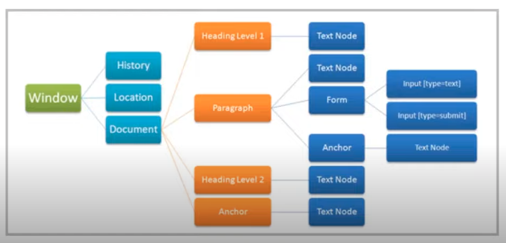
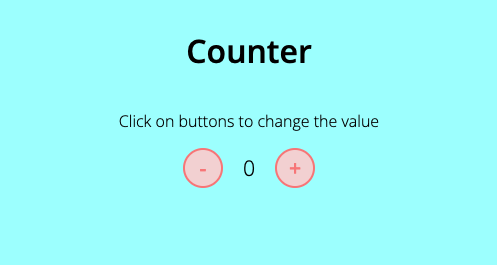
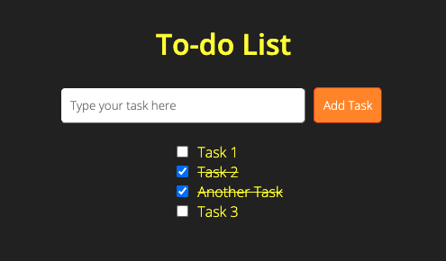

<div align="center">
   
</div>

# Introdução ao Javascript

## O que é Javascript?

### História:

Javascript é uma linguagem interpretada, multiparadigma e baseada em protótipos, que foi criada em 1995 por Brendan Eich, um desenvolvedor da Netscape.

### O que é um Protótipo?

"Protótipos são o mecanismo pelo qual objetos Javascript herdam recursos uns dos outros.

[...] para forneceder herança, os objetos podem ter um objeto de prot[otipo, que atua como um objeto modelo do qual herda métodos e propriedades."

Mais detalhes em [Protótipos de objetos](https://developer.mozilla.org/pt-BR/docs/Learn/JavaScript/Objects/Object_prototypes)

### Evolução do ECMAScript:

<div align="center">
   
</div>

### Aplicações:

- Web
- Mobile
- Smartwatches
- Games
- IoT
- APIs

## Console

```javascript
console.log("Hello World");
```

## Javascript numa página da web

### DOM (Document Object Model)

<div align="center">
   
</div>

Segundo a [Mozilla Developer Network](https://developer.mozilla.org/pt-BR/docs/Web/API/Document_Object_Model/Introduction):

"O DOM é a representação de dados dos objetos que compõem a estrutura e o conteúdo de um documento na Web".

"[...] O DOM representa o documento com nós e objetos, dessa forma, as linguagens de programação podem se conectar à página.",

"O DOM é uma representação orientada a objetos da página da web, que pode ser modificada com uma linguagem de script como JavaScript"

## Atividades práticas

### [Counter](counter/)

<div align="center">
  
</div>

### [To-do List](to-do-list/)

<div align="center">
  
</div>

## Framework e mercado de trabalho

### Frameworks:

- [Angular](https://angular.io/)
- [React](https://reactjs.org/)
- [Vue](https://vuejs.org/)

### Referências:

<div align="center">
  
</div>
