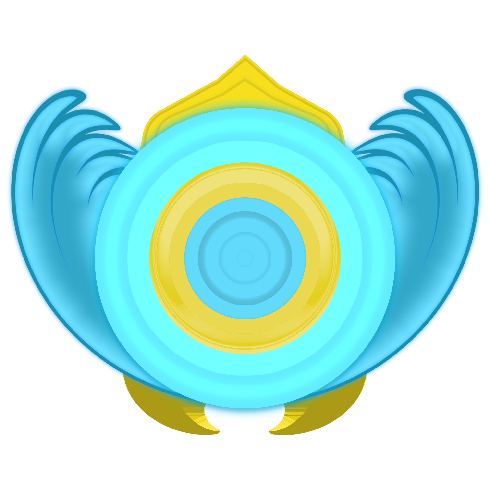

<div align="center">
   
</div>

# Introdução ao ReactJS

## História e Conceitos

"Uma biblioteca Javascript para criar interfaces de usuário" - ReactJS

Criado em 2011 por Jordan Walke no Facebook, baseado no XHP, um framework para criação de HTML no PHP.

 - 2012 - Utilizado no Instagram;
 - 2013 - Anúncio para liberação Opensource na JSConfUS;
 - 2015 - React Native;
 - 2015 - UWP (Universal Windows Platform);

ReactJS é uma biblioteca e não um framework, sendo sua principal função a criação de interface para o usuário.

 - ReactJS usa uma abordagem Declarativa.
 - ReactJS é baseado em componentes.


## Configuração do ReactJS

 - React Create App;
 - React Scripts;
 - Task Runners e Bundler Sizers;

## Instalação do ReactJS com React Scripts

Inicie o projeto com o comando:
```bash
npm init
```

Instale as dependências do ReactJS com o comando:
```bash
npm install react react-dom react-scripts
```

## O que é JSX?

Nem HTML e nem uma string!
```jsx
const element = <h1>Hello, world</h1>;
```

React não separa as tecnologias colocando marcação em arquivos separados, e sim separa conceitos e mantém o código pouco acoplado chamando-os de componentes.

O Browser não interpreta JSX, por isso é necessário um transpilador, sendo o mais utilizado o Babel.

## Ciclo de vida do ReactJS

 - Inicialização;
 - Montagem;
 - Atualização;
 - Desmontagem;

## Estado

Nenhum component pai ou filho devem saber se outro componente possui estado ou não.


## O que é Webpack?

Webpack é um **module bundler** (um empacotador de módulos para aplicações JS), gerando bundlers que serão utilizados no HTML, em ES5.

Além de Javascript, o Webpack também tem suporte para: 
 - Fontes;
 - CSS;
 - Images;
 - HTML;
 - Plugins

Link do Webpack: https://webpack.js.org/

## Configuração do Webpack

### Principais Conceitos

 - `Entry`: Utilizando grafo, o Webpack precisa de um ponto de entrada para buscar todos os módulos e dependências;
 - `Output`: É para determinar quais são os bundlers que o webpack irá emitir;
 - `Loaders`: É para permitir que o Webpack utilize outros tipos de arquivos, como, por exemplo, o CSS;
 - `Plugins`: Plugins podem ser utilizados para otimização de pacotes, minificação, injeção de scripts e muitos mais;
 - `Mode`: O modo de desenvolvimento, que pode ser `development` ou `production` ou `none`.
   - `Production Mode`: Otimização de pacotes, minificação, injeção de scripts e muitos mais;
   - `Development Mode`: Não otimização de pacotes, não minificação, é executado com 3 plugins: `UglifyJSPlugin`, `ModuleConcatenationPlugin` e `NoEmitOnErrorsPlugin`.
  
### Configuração do Webpack

Criação do arquivo `webpack.config.js`:
```bash
npm install webpack webpack-cli --save-dev
```

Adicione a linha abaixo em `scripts` no arquivo `package.json`:
```javascript
  "build": "webpack --mode production",
```

Em seguinda confire o webpack no arquivo `webpack.config.js`:
```javascript
const path = require('path');

module.exports = {
  entry: './src/index.js',
  output: {
    path: path.resolve(__dirname, 'dist'),
    filename: 'bundle.js'
  }
}
```
#### Instalação do Babel
Instale os pacotes relacionados com o Babel:
```bash
 npm install @babel/core babel-loader @babel/preset-env @babel/preset-react --save-dev
```
Adicione o seguinte conteúdo após `output` no arquivo `webpack.config.js`:
```javascript
  module: {
    rules: [
      {
        test: /\.(js|jsx)$/, 
        exclude: /node_modules/,
        use: {
          loader: 'babel-loader',
        }
      }
    ]
  }
```

Crie um arquivo `.babelrc` no diretório raiz do projeto:
```javascript
{
  "presets": ["@babel/preset-env", "@babel/preset-react"]
}
```
E instale os seguintes pacotes:
```bash
npm install babel-preset-react --save-dev
npm install react react-dom
```

Agora precisamos instalar e configurar os plugins `html-webpack-plugin` e `html-loader`:
```bash
npm install html-webpack-plugin html-loader --save-dev
```

Agora para ver o nosso projeto funcionando, podemos instalar e configurar o `webpack-dev-server`:
```bash
npm install webpack-dev-server --save-dev
```
Adicione a linha abaixo em `scripts` no arquivo `package.json`:
```javascript
"start": "webpack-dev-server --mode development",
```

Para ver o projeto funcionando, execute o comando:
```bash
npm run start
```

## Renderização Condicional

"Em React, você pode criar componentes distintos que encapsulam o comportamento que você precisa. Então, você pode renderizar apenas alguns dos elementos, dependendo do estado da sua aplicação." - https://pt-br.reactjs.org/docs/conditional-rendering.html

## Manipulação de Eventos

"Manipular eventos em elementos React é muito semelhante a manipular eventos em elementos do DOM. Existem algumas diferenças sintáticas:
 - Eventos em React são nomeados usando camelCase ao invés de letras minúsculas;
 - Com `JSX`, você passa uma função como manipulador de eventos ao invés de um texto."

https://pt-br.reactjs.org/docs/handling-events.html

## Pensando do jeito React

 - Comece com um Mock;
 - Separe a UI em uma hierarquia de componentes;
 - Crie uma versão estática em React;
 - Identifique a representação mínima (mas completa) do state da UI;
 - Identifique onde o State deve ficar;
 - Adicione o fluxo de dados inverso;