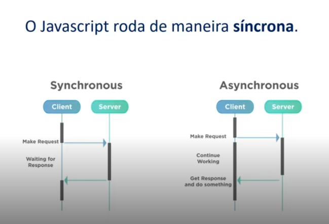
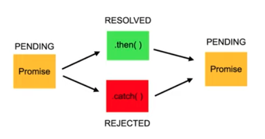
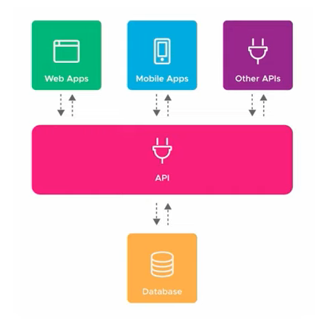

<div align="center">
   
</div>

# Javascript Assíncrono

## Assincronissidade

"Assíncrono é o que não ocorre ou não se efetiva ao mesmo tempo."

<div align="center">
  
</div>

### Promises

Objeto de processamento assíncrono. Inicialmente, seu valor é desconhecido. Ela pode, então, ser **resolvida** ou **rejeitada**.
"Um `Promise` (de "promessa") representa um valor que pode estar disponível agora, no futuro ou nunca." - [MDN](https://developer.mozilla.org/pt-BR/docs/Web/JavaScript/Reference/Global_Objects/Promise)

<div align="center">
  
</div>

#### Estados

  - **Pending**: O valor da promise não foi determinado.
  - **Fulfilled**: O valor da promise foi determinado.
  - **Rejected**: O valor da promise não foi determinado.

"Uma promessa pendente pode se tornar realizada com um valor ou rejeitada por um motivo (erro). Quando um desses estados ocorre, o método `then` do `Promise` é chamado, e ele chama o método de tratamento associado ao estado (`rejected` ou `resolved`)." [MDN](https://developer.mozilla.org/pt-BR/docs/Web/JavaScript/Reference/Global_Objects/Promise)

#### Estrutura

```javascript
const myPromise = new Promise((resolve, reject) => {
  window.setTimeout(() => {
    resolve('Resolved!');
  }, 1000);
});


await myPromise
  .then((result)  => `${result } through then`)
  .then((result)  => `${result } - now it is done`)
  .catch((error)  => console.log(error.message));

// Resolved! through then - now it is done
```

### Async/Await

Funções assíncronas precisam dessas duas palavras chave.

```javascript
async resolvePromise() {
  const myPromise = new Promise((resolve, reject) => {
    window.setTimeout(() => {
      resolve('Solved!');
    }, 1000);
  });

  const resolved = await myPromise
    .then((result) => `${result } through then`);
    .catch((error) => console.log(error.message));


  return resolved;
}
```

## Consumindo APIs

### API (Application Programming Interface)

Uma API é uma forma de intermediar os resultados do back-end com o que é apresentado no front-end.

<div align="center">
  
</div>


### JSON (JavaScript Object Notation)

É muito comum que APIs retornem dados em formato JSON.

```json
{
  "name": "John",
  "age": 30,
  "cars": [
    "Ford",
    "BMW",
    "Fiat"
  ]
}
```

### Fetch

Fetch retorna um objeto Promise.

  - **fetch**: Função assíncrona para consumir APIs.
  - **Response**: Objeto que representa a resposta da API.
  - **json()**: Método que retorna o resultado da API em formato JSON.

```javascript
fetch('https://api.github.com/users/octocat')
  .then(response => response.json())
  .then(data => console.log(data));

  // {
  //   "login": "octocat",
  //   "id": 1,
  //   "node_id": "MDQ6VXNlcjE=",
  //    ...
  // }
```

## Atividade Prática

### [Picsum](picsum/)

<div align="center">
  
</div>