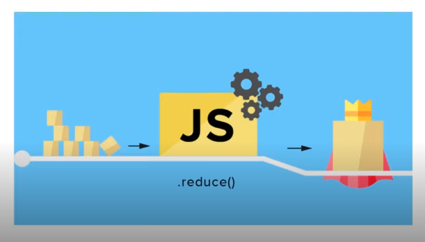

<div align="center">
   
</div>

# Map, Filter e Reduce

## Map

O método map() cria um novo array com o resultado da função de callback aplicada a cada elemento do array original.

O método map():
 - Não altera o array original;
 - Realiza as operações em ordem.

### Sintaxe

 - `callback`: Função que será aplicada a cada elemento do array.
 - `thisArg` (opcional): Elemento que será usado como this no contexto da função callback.
  
```javascript
array.map(callback, thisArg)
```
### Exemplo:

```javascript
const numbers = [1, 2, 3, 4, 5];
const doubleNumbers = numbers.map(number => number * 2);
console.log(doubleNumbers); // [2, 4, 6, 8, 10]
```

### Map vs ForEach

```javascript
const numbers = [1, 2, 3, 4, 5];

// map method
mapDoubleNumbers = numbers.map(number => number * 2);
console.log(mapDoubleNumbers); // [2, 4, 6, 8, 10]

// forEach method
foreachDoubleNumbers = [];
numbers.forEach(number => {
  foreachDoubleNumbers.push(number * 2);
});
console.log(foreachDoubleNumbers); // [2, 4, 6, 8, 10]
```

## Filter 

  - O método filter() cria um novo array com os elementos do array original que passaram no teste implementado pela função de callback.
  - O método filter() não altera o array original.

### Sintaxe

 - `callback`: Função que será aplicada a cada elemento do array.
 - `thisArg` (opcional): Elemento que será usado como this no contexto da função callback.

```javascript
array.filter(callback, thisArg)
```

### Exemplo:

```javascript
const fruits = ['green apple', 'fugi apple', 'banana', 'grape', 'orange', 'plum'];
const apples = fruits.filter(fruit => fruit.includes('apple'));
console.log(apples); // ['green apple', 'fugi apple']
```

## Reduce

O método reduce() aplica uma função de callback a cada elemento do array, reduzindo o array em um único valor.

<div align="center">
  
</div>

### Sintaxe

  - `callback`: função a ser executada a partir do acumulador;
  - `initialValue` (opcional): valor sobre o qual o retorno final irá atuar.

```javascript
array.reduce(callback, initialValue)
```

```javascript
const callback = function (accumulator, currentValue) {
  // do something
};
array.reduce(callback, initialValue);
```

### Exemplo:

```javascript
const numbers = [1, 2, 3, 4, 5];
const sum = numbers.reduce((accumulator, currentValue) => accumulator + currentValue);
console.log(sum); // 15
```

## Atividades Práticas

### Map

 - Pratique a sintaxe de multiplicação de números, uma vez utilizando o parâmetro `this` de um objeto criado por você, e depois sem ele.

```javascript
const numbers = [1, 2, 3, 4, 5];
const config = { 
  multiplier: 5,
};

// With `thisArg`
function mapWithThisArg(numbers, config) {
  const result = numbers.map(function (number) {
    return parseInt(number) * this.multiplier
  }, config);

  return result;
}

const multipliedNumbers = mapWithThisArg(numbers, config);
console.log(multipliedNumbers); // [5, 10, 15, 20, 25]

// Without `thisArg`
function mapWithoutThisArg(numbers) {
  return numbers.map(number => parseInt(number) * 7);
}

console.log(mapWithoutThisArg(numbers)); // [7, 14, 21, 28, 35]
```

### Filter

 - Filtre e retorne todos os números pares do array.

```javascript
const numbers = [1, 2, 3, 4, 5, 6, 7, 8, 9, 10];

const evenNumbers = numbers.filter(number => number % 2 === 0);
console.log(evenNumbers); // [2, 4, 6, 8, 10]
```

### Reduce

1. Some todos os números do array.
2. Crie uma função que recebe uma lista de preços e um número representando o saldo disponível. Calcule qual será o saldo final após subtrair todos os preços da lista enviada.

#### Exercício 1:
```javascript
const prices = [10, 20, 30, 40, 50];
const sum = prices.reduce((accumulator, currentValue) => accumulator + currentValue);
console.log(sum) // 150
```

#### Exercício 2:
```javascript
const prices = [10, 20, 30, 40, 50, 80];
const balance = 300;

const currentBalance = prices.reduce((accumulator, currentValue) => accumulator - currentValue, balance);

console.log(currentBalance); // 70
```