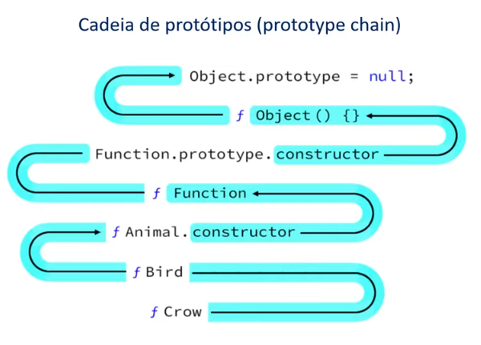

<div align="center">
   
</div>

# Orientação a Objetos

## Pilares

 - Herança
 - Polimorfismo
 - Encapusulamento
 - Abstração

### Abstração

Definição de Abstração:

"Processo mental que consiste em isolar um aspecto determinado de um estado de coisas relativamente complexo, a fim de simplificar a sua avaliação, classificação ou para permitir a comunicação do mesmo"

### Herança

O objeto filho herda propriedades e comportamentos do objeto pai.


### Encapusulamento

Cada classe tem propriedades e métodos independentes do restante do código.

### Polimorfismo

Objetos podem herdar a mesma classe pai, mas se comportam de forma diferente quando invocamos seus métodos.

## OO em Javascript

### Protótipos

Todos os objetos em Javascript herdam propriedades e métodos de um objeto chamado protótipo. O protótipo é um objeto que é usado como um template para criar novos objetos. O Objeto Object.prototype é o protótipo de todos os objetos.

<div align="center">
   
</div>

## Classes

```javascript
class Meal {
  constructor(name, price) {
    this.name = name;
    this.price = price;
  }

  getName() {
    return this.name;
  }
}
```

Javascript não possui classes nativamente. Todas as classes são objetos e a herança é feita através do protótipo.


## Atividade Prática

Código da atividade prática disponível [aqui](scripts.js).