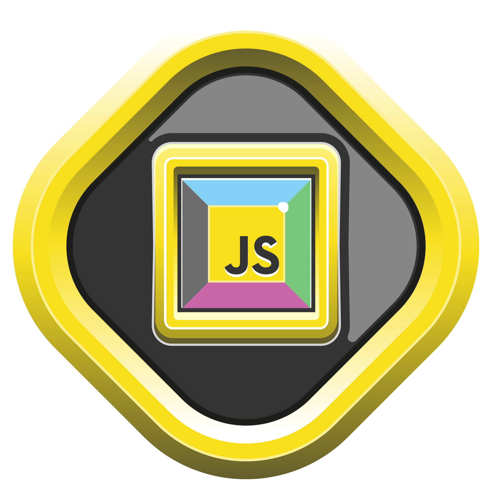

   

# Sintaxe Basica JavaScript

## Variáveis e seus valores

### Tipagem:

A tipagem funciona como uma regra de uso de dados, quanto mais forte for a tipagem, mais obrigatório é a declaraçãso do tipo de dado.
A tipagem em Javascript é **fraca**, a declaração dos dados acontece de forma dinâmico.

### Tipos primitivos:

- **Number**: números inteiros e reais
- **String**: texto
- **Boolean**: verdadeiro ou falso
- **Null**: nulo
- **Undefined**: indefinido

### Declaração de variáveis:

`var`: escopo global e local, pode ter seu valor alterado, se não tiver um valor inicial será tratada como `null`.

`let`: escopo local de bloco, pode ter seu valor alterado, se não tiver um valor inicial será tratada como null;

`const`: escopo local de bloco, o valor inicial é obrigatório e não pode ser alterado.

### Operadores aritméticos:

- `+` Adição;
- `-` Subtração;
- `*` Multiplicação;
- `/` Divisão;
- `%` Resto da divisão;
- `**` Potência;

Operadores relacionais:

- `<` Menor que;
- `>` Maior que;
- `<=` Menor ou igual que;
- `>=` Maior ou igual que;

Operadores Lógicos:

- `&&` E;
- `||` Ou;
- `!` Não;

Mais informações:

- `Tipagem` - https://danvitoriano.medium.com/tipagem-din%C3%A2mica-no-javascript-e3551a445b38
- `Operadores aritméticos` - https://www.w3schools.com/js/js_arithmetic.asp
- `Operadores relacionais` - https://www.w3schools.com/js/js_comparisons.asp
- `Operadores lógicos` - https://www.w3schools.com/js/js_logical.asp
- `Variáveis` - https://www.w3schools.com/js/js_variables.asp
- `Escopo` - https://www.w3schools.com/js/js_scope.asp

## Vetores e objetos

Array é um tipo de lista, ou matriz de variáveis, onde cada variável possui um índice. Os valores podem ser de vários tipos. Mais informações: https://www.w3schools.com/js/js_arrays.asp

### Manipulando Arrays:

Ao ser declarado, o Array traz consigo uma série de métodos, como:

- `push`: adiciona um novo valor no final do Array;
- `pop`: remove o último valor do Array;
- `shift`: remove o primeiro valor do Array;
- `unshift`: adiciona um novo valor no início do Array;
- `splice`: remove um valor do Array;
- `slice`: retorna um novo Array a partir de um intervalo de valores;
- `sort`: ordena os valores do Array;
- `reverse`: inverte os valores do Array;
- `forEach`: executa uma função em cada valor do Array;
- `indexOf`: retorna o índice do valor do Array;

### Objetos:

Dados que possuem **propriedades** e **valores** que definem suas características. Deve ser declarado entre chaves. Mais informações: https://www.w3schools.com/js/js_objects.asp

#### Desestruturação de objetos:

    const person = {
        name: 'John',
        age: 23,
        address: {
            city: 'São Paulo',
            state: 'SP'
        }
    }

    const { name, age, address: { city } } = person;

    console.log(name, age, city);   // John 23 São Paulo

    // Usando o Spread Operador `...` para desestruturar um objeto:

    const { address, ...personWithoutAddress } = person;

    console.log(address) // { city: 'São Paulo', state: 'SP' }
    console.log(personWithoutAddress); // { name: 'John', age: 23 }

## Aprofundando em funções

Existem vários tipos de funções, como:

### Declarativas;

Forma mais comum, onde utilizamos a palavra chave `function` seguida de um nome para declarar uma função.

    function sum(a, b) {
        return a + b;
    }

    console.log(sum(1, 2)); // 3

### Expressões;

Funções de expressão podem ter um nome ou ser anônimas. São funções atribuídas à expressões, como:

    const sum = function(a, b) {
        return a + b;
    }

    console.log(sum(1, 2)); // 3

### Arrow Functions;

Presentes desde o ES6 (ECMAScript 2015), são funções anônimas, mas com uma sintaxe mais reduzida.

    const sum = (a, b) => {
        return a + b;
    }

    console.log(sum(1, 2)); // 3
