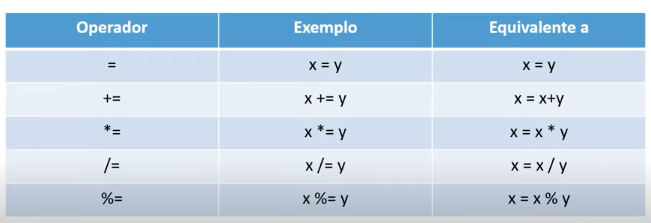

<div align="center">
   
</div>

# Sintaxe e Operadores

## Atribuição

 - `=` Atribuição
 - `+=` Atribuição aditiva
 - `-=` Atribuição subtrativa
 - `*=` Atribuição multiplicativa
 - `/=` Atribuição divisiva
 - `%=` Atribuição resto da divisão

<div align="center">
   
</div>

## Tipos de Operadores

  - `+` Adição
  - `-` Subtração
  - `*` Multiplicação
  - `**` Potência
  - `/` Divisão
  - `%` Resto da divisão
  - `++` Incremento
  - `--` Decremento

## Operadores de Comparação

  - `==` Igual
  - `===` Identico (com comparação de tipo)
  - `!=` Diferente
  - `!==` Não identico (com comparação de tipo)
  - `>` Maior que
  - `<` Menor que
  - `>=` Maior ou igual
  - `<=` Menor ou igual
  
## Operadores Lógicos

  - `&&` E
  - `||` Ou
  - `!` Não

## Operador Condicional (ternário)

  - `?` Condicional
  - `:` Se não

Exemplo:
```javascript
  const a = 10;
  const b = 20;
  const c = a > b ? a : b;
  console.log(c); // 20
```

## Atividade Prática

```javascript
function compareNumbers(number1, number2) {
  const sum = number1 + number2;

  let message = number1 === number2 ? 
    `The numbers ${number1} and ${number2} are equal.` : 
    `The numbers ${number1} and ${number2} are not equal.`; 
    
  message += ` The sum is ${sum}`;
  
  message += sum < 10 ? 
    ', which is less than 10' :
    ', which is greater than 10';   
  
  message += sum < 20 ? ' and less than 20' : ' and greater than 20';

  return message;
}

const result = compareNumbers(4, 8);

console.log(result); 
// The numbers 4 and 8 are not equal. The sum is 12, which is greater than 10 and less than 20
```