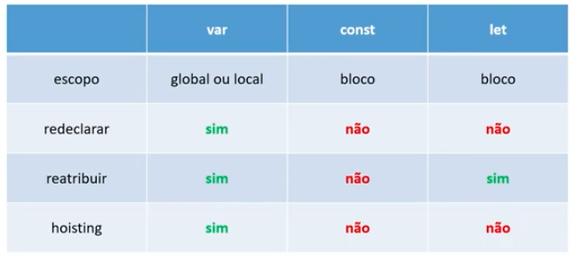
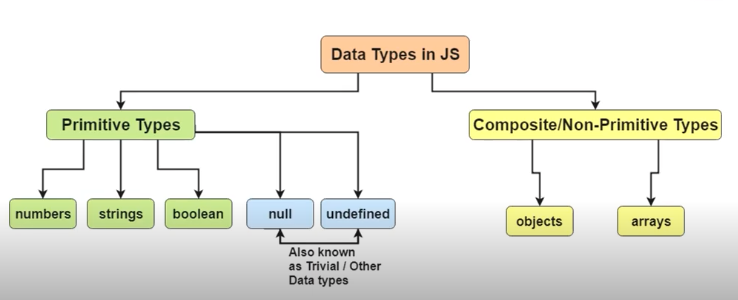
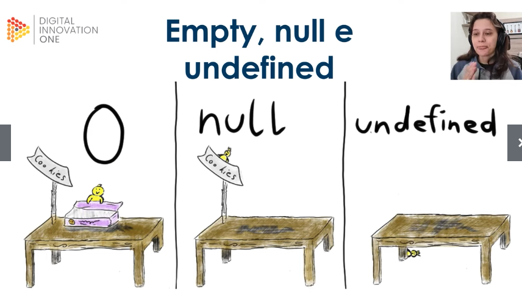

<div align="center">
   
</div>

# Variáveis e Tipos

## Atribuindo Valores

 - `var` pode ser redeclarada, mas `let` não pode.
 - `var` e `let` podem ser reatribuídas.

### Hoisting

  - `var` é uma variável que pode ser usada antes de ser declarada.
  - `let` é uma variável que só pode ser usada depois de ser declarada.

```javascript
number = 10;
number++;
var number;
console.log(number); // 11
```

### Constantes

  - tem escopo de bloco;
  - deve ser declarada em `SNAKE_UPPER_CASE`;
  - Não faz hoisting.
  - deve ser declara utilizando a palavra `const` e não pode ser reatribuída.

```javascript
const DAYS_IN_WEEK = 7;
```

### var, let e const

<div align="center">
  
</div>

## Tipos de Dados

Javascript é uma linguagem de **tipagem dinâmica** (tipagem fraca), ou seja, antes de declarar um valor, você não especifica o **tipo** dele.

```javascript
let one = "1";
console.log(typeof one); // string
one = 1;
console.log(typeof one); // number
```

### Tipos Primitivos
 - `string`
 - `number`
 - `boolean`
 - `null`
 - `undefined`

Tipos primitivos não possuem métodos.

### Tipos Não Primitivos
 - `object`
 - `array`

<div align="center">
  
</div>


### Numbers

```javascript
Math.PI // 3.141592653589793

Math.floor(5 / 3); // 1

Math.ceil(5 / 3); // 2

Math.round(10 / 3); // 3
```

### Arrays

```javascript
let someArray = [1, 2, 3];
someArray.push(4); // [1, 2, 3, 4]
someArray.pop(); // [1, 2, 3]
someArray.shift(); // [2, 3]
someArray.unshift(1); // [1, 2, 3]
someArray.length; // 3
someArray[2]; // 3
someArray.includes(3); // true
someArray.reverse(); // [3, 2, 1]
console.log(someArray); // [3, 2, 1]
```

### Objetos

```javascript
let someObject = {
  name: "John",
  age: 30
};

console.log(typeof someObject); // object
console.log(someObject); // {name: "John", age: 30}
console.log(someObject.name); // John
console.log(Object.keys(someObject)); // ["name", "age"]
console.log(Object.values(someObject)); // ["John", 30]
```

### empty, undefined and null

<div align="center">
  
</div>


## Atividade Prática

### Palíndromo

  - Palíndromo é uma palavra ou frase que se lê de **trás para frente**.
  - Exemplo: `"arara"`


O código desta atividade está disponível [aqui](palindrome.js)

### Substituir números pares

O código desta atividade está disponível [aqui](replace-even-numbers.js)
